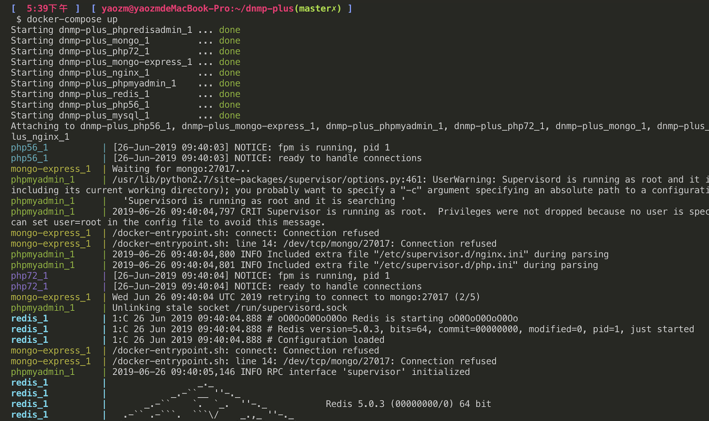
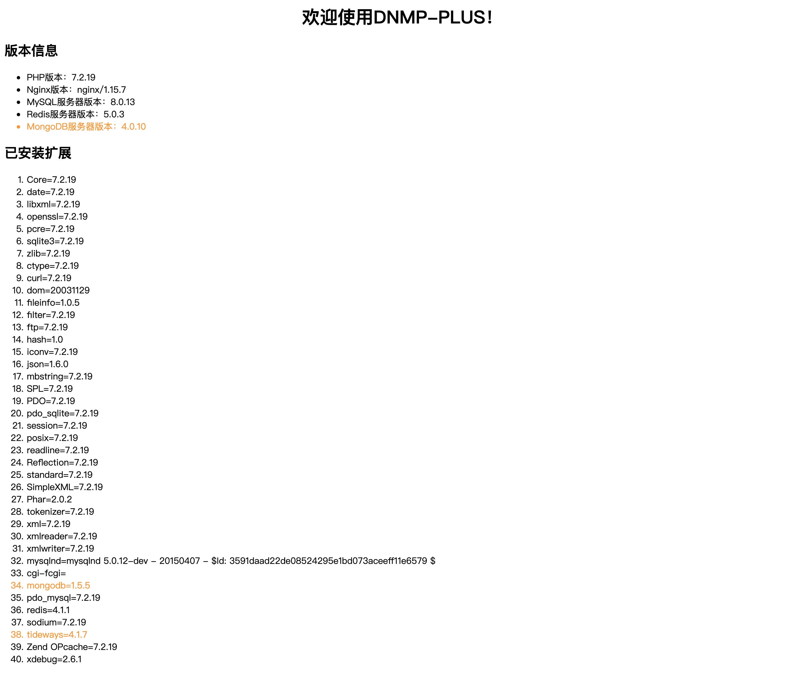
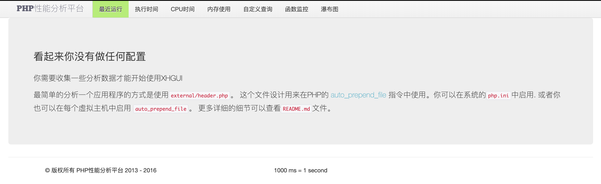
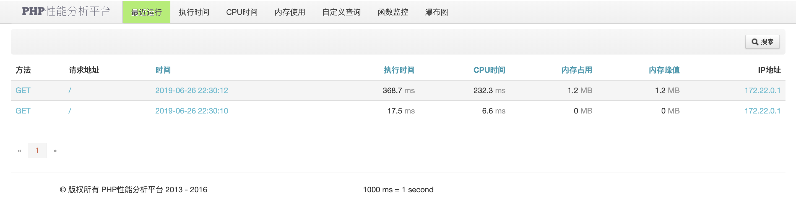

# DNMP PLUS

**dnmp** = `Docker` + `Nginx` + `MySQL` + `PHP` + `Redis` + `MongDB`

**plus** = `xhgui` + `xhprof` + `tideways`

**dnmp-plus** = `PHPer 的一键安装开发环境` + `PHP 非侵入式监控平台（优化系统性能、定位 Bug 的神器）`

---

[](https://travis-ci.org/guanguans/dnmp-plus)

简体中文 | [English](README-EN.md)

**[dnmp-plus](https://github.com/guanguans/dnmp-plus)** 在 [yeszao](https://github.com/yeszao) 的 [DNMP](https://github.com/yeszao/dnmp) 基础上新增：

* [PHP xhprof 扩展](https://github.com/phacility/xhprof) - Facebook 开发的 PHP 性能追踪及分析工具
* [PHP tideways 扩展](https://github.com/tideways/php-xhprof-extension) - xhprof 的分支，支持 PHP7
* PHP mongodb 扩展
* MongoDB 服务
* Mongo Express - MongoDB 服务管理系统
* [xhgui](https://github.com/laynefyc/xhgui-branch) - xhprof 分析数据数据的 GUI 系统



---

## 目录结构

``` bash
├── .github                     Github 配置目录
├── conf                        配置文件目录
│   ├── conf.d                  Nginx 用户站点配置目录
│   ├── mysql.cnf               MySQL 用户配置文件
│   ├── nginx.conf              Nginx 默认配置文件
│   ├── php-fpm.conf            PHP-FPM 配置文件
│   ├── php.ini                 PHP 配置文件
│   ├── redis.conf              Redis 配置文件
├── docs                        文档目录
├── extensions                  PHP 扩展源码包
├── log                         日志目录
├── mongo                       MongoDB 数据目录
├── mysql                       MySQL 数据目录
├── www                         PHP 代码目录
├── Dockerfile                  PHP 镜像构建文件
├── docker-compose-sample.yml   Docker 服务配置示例文件
├── env.smaple                  环境配置示例文件
└── travis-build.sh             Travis CI 构建脚本
```

## 环境要求

* Docker
* Docker-compose
* Git

## 快速使用

``` bash
$ git clone https://github.com/guanguans/dnmp-plus.git --recursive
$ cd dnmp-plus
$ cp env.sample .env
$ cp docker-compose-sample.yml docker-compose.yml
# 服务选项：nginx、php72、php56、mysql、mongo、redis、phpmyadmin、phpredisadmin、mongo-express
$ docker-compose up -d php72 nginx mysql mongo
```

OK，你现在已经拥有了一个 dnmp-plus 开发环境，默认 web 根目录 `www/localhost/`，浏览器访问 [http://localhost](http://localhost)



## 基本使用

``` bash
# 服务选项：nginx、php72、php56、mysql、mongo、redis、phpmyadmin、phpredisadmin、mongo-express

# 创建并且启动容器
$ docker-compose up 服务1 服务2 ...
# 创建并且启动所有容器
$ docker-compose up

# 创建并且已后台运行的方式启动容器
$ docker-compose up -d 服务1 服务2 ...

# 启动服务
$ docker-compose start 服务1 服务2 ...

# 停止服务
$ docker-compose stop 服务1 服务2 ...

# 重启服务
$ docker-compose restart 服务1 服务2 ...

# 构建或者重新构建服务
$ docker-compose build 服务1 服务2 ...

# 进入命令行容器
$ docker-compose exec 服务 bash

# 删除并且停止容器
$ docker-compose rm 服务1 服务2 ...

# 停止并删除容器，网络，图像和挂载卷
$ docker-compose down 服务1 服务2 ...
```

## xhgui 使用，可以参考  https://github.com/guanguans/guanguans.github.io/issues/9

### 安装

``` bash
$ cd www/xhgui-branch
$ composer install
```

### 修改 xhgui-branch 配置文件 `www/xhgui-branch/config/config.default.php`

``` php
<?php
return array(
    ...
    'debug'        => true, // 改为true，便于调试
    'mode'         => 'development',
    ...
    'extension'    => 'tideways', // 改为支持 PHP7 的 tideways
    ...
    'save.handler' => 'mongodb',
    'db.host'      => 'mongodb://mongo:27017', // 127.0.0.1 改为 mongo
    ...
);
```

### hosts 文件中增加

``` bash
127.0.0.1             xhgui.test
```

### 浏览器访问 http://xhgui.test



### 在要分析项目 nginx 配置文件中修改，以默认的 localhost 配置 `conf/conf.d/localhost.conf` 为例

``` conf
...
location ~ \.php$ {
    fastcgi_pass   php72:9000;
    fastcgi_index  index.php;
    include        fastcgi_params;
    fastcgi_param  PATH_INFO $fastcgi_path_info;
    fastcgi_param  SCRIPT_FILENAME  $document_root$fastcgi_script_name;
    # 在执行主程序之前运行我们指定的PHP脚本
    fastcgi_param  PHP_VALUE "auto_prepend_file=/var/www/html/xhgui-branch/external/header.php"; 
}
...
``` 

### 重启 nginx

``` bash
$ docker-compose restart nginx
```

### 浏览器访问 [http://localhost](http://localhost)，再访问 [http://xhgui.test](http://xhgui.test)，此时已经有了内容，愉快的查看项目的性能追踪及分析吧




## PHP 和扩展

### 切换 Nginx 使用的 PHP 版本

默认同时创建 `PHP5.6` 和 `PHP7.2` 2 个 PHP 版本的容器，切换 PHP 仅需修改相应站点 Nginx 配置的 `fastcgi_pass` 选项，例如，示例的 [http://localhost](http://localhost) 用的是 PHP7.2，Nginx 配置：

``` conf
fastcgi_pass   php72:9000;
```

要改用 PHP5.6，修改为：

``` conf
fastcgi_pass   php56:9000;
```

重启 Nginx 生效

``` bash
$ docker-compose restart nginx
```

### 安装 PHP 扩展

PHP 的很多功能都是通过扩展实现，而安装扩展是一个略费时间的过程，
所以，除 PHP 内置扩展外，在 `env.sample` 文件中我们仅默认安装少量扩展，
如果要安装更多扩展，请打开你的 `.env` 文件修改如下的 PHP 配置，
增加需要的 PHP 扩展：

``` bash
PHP72_EXTENSIONS=pdo_mysql,opcache,redis,xdebug,mongodb,tideways
PHP56_EXTENSIONS=opcache,redis,xdebug,mongodb,xhprof
```

然后重新构建 PHP 镜像

``` bash
docker-compose build php72
docker-compose up -d
```

## 使用 Log

Log 文件生成的位置依赖于 conf 下各 log 配置的值。

### Nginx 日志

Nginx 日志是我们用得最多的日志，所以我们单独放在根目录 `log` 下。`log` 会目录映射 Nginx 容器的 `/var/log/nginx` 目录，所以在 Nginx 配置文件中，需要输出 log 的位置，我们需要配置到 `/var/log/nginx` 目录，如：

``` conf
error_log  /var/log/nginx/nginx.localhost.error.log  warn;
```

### MySQL 日志

因为 MySQL 容器中的 MySQL 使用的是 `mysql` 用户启动，它无法自行在 `/var/log` 下的增加日志文件。所以，我们把 MySQL 的日志放在与 data 一样的目录，即项目的`mysql`目录下，对应容器中的 `/var/lib/mysql/` 目录。

mysql.conf 中的日志文件的配置：

``` conf
slow-query-log-file     = /var/lib/mysql/mysql.slow.log
log-error               = /var/lib/mysql/mysql.error.log
```

## 数据库管理

* 默认 phpMyAdmin 地址：http://localhost:8080
* 默认 phpRedisAdmin 地址：http://localhost:8081
* 默认 Mongo Express 地址：http://localhost:8082

## 参考链接

* [https://github.com/yeszao/dnmp](https://github.com/yeszao/dnmp)，yeszao

## License

[MIT](LICENSE)
